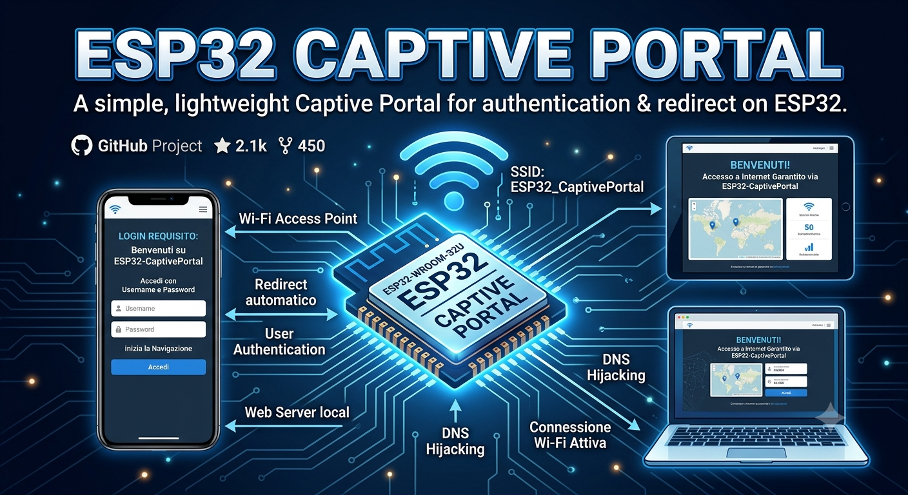

# ESP32-S3 Captive Portal



Progetto PlatformIO per ESP32-S3-N16R8 (16MB Flash / 8MB PSRAM) che implementa
un captive portal completo: AP + DNS spoofing + web server + persistenza su
LittleFS.

## Struttura

```
captive-portal/
├── platformio.ini
├── src/
│   ├── main.cpp          # setup/loop, routing HTTP, redirect captive portal
│   ├── CaptiveDNS.h/.cpp # wrapper DNSServer (step 3 del progetto)
├── data/                  # contenuto caricato su LittleFS
│   ├── index.html
│   ├── style.css
│   └── app.js
```

## Apertura in CLion
1. **Scarica la repo da Github**:
  ```bash
  git clone https://github.com/airpogramsbeenmade/ESP32-Captive-Portal.git
  ``` 
2. **Apri CLion** → **File > Open** → seleziona la cartella `ESP32-Captive-Portal/`.
3. Assicurati che il plugin **PlatformIO for CLion** sia attivo
   (Settings > Plugins). CLion rileverà automaticamente `platformio.ini`
   e configurerà il progetto CMake-like sotto il cofano.
4. Nella toolbar in basso (PlatformIO Core) seleziona l'ambiente
   `esp32-s3-n16r8`.

## Comandi utili

Dal terminale integrato di CLion (o dalla toolbar PlatformIO):

**Compila il firmware**
```bash
pio run
```
**Carica il firmware sulla scheda**
```bash
pio run -t upload
```
**IMPORTANTE: carica la cartella data/ su LittleFS**
(va rifatto ogni volta che modifichi index.html / style.css / app.js)
```bash
pio run -t uploadfs
```
**Monitor seriale**(opzionale)
```bash
pio device monitor
```

⚠️ **Nota**: `uploadfs` e `upload` sono due step separati. Se non carichi
il filesystem, il dispositivo si avvia ma `LittleFS.exists("/index.html")`
fallirà e il webserver risponderà 500 sulla root.

## Note tecniche

- **Partizioni**: `default_16MB.csv` riserva uno spazio ampio per LittleFS,
  sfruttando i 16MB di flash del modulo N16R8.
- **PSRAM**: configurata come Octal-SPI (`opi`), corretta per il modulo R8.
  Il progetto attuale non la usa attivamente, ma è pronta se in futuro vuoi
  bufferizzare payload grandi o servire asset dalla PSRAM.
- **Rilevamento captive portal**: `handleNotFound()` in `main.cpp` intercetta
  sia gli endpoint di probe noti dei vari OS (`/generate_204`,
  `/hotspot-detect.html`, `/ncsi.txt`, ecc.) sia qualunque richiesta con
  Host header diverso dall'IP dell'AP, rispondendo sempre con un redirect
  302 verso `http://192.168.4.1/`.
- **Payload atteso da `/api/submit`** (assunzione fatta in fase di design,
  modificabile in `handleSubmit()` e in `data/app.js`):
  ```json
  { "email": "string", "password": "string" }
  ```
  Viene scritto integralmente in `/config.json` su LittleFS.

## Pannello di debug `/admin`

Raggiungibile da browser su `http://192.168.4.1/admin` mentre sei connesso
all'Access Point del dispositivo. Protetto da HTTP Basic Auth:

- **user**: `admin`
- **password**: `admin`

Mostra il contenuto (pretty-printed) dell'ultimo `/config.json` salvato su
LittleFS. Utile in fase di sviluppo per verificare rapidamente cosa arriva
dal form senza dover leggere il filesystem via `pio` o seriale.

⚠️ Credenziali hardcoded in chiaro in `main.cpp` (`ADMIN_USER` / `ADMIN_PASS`),
pensate solo per debug locale. Prima di qualunque uso reale: cambiale, e
valuta se esporre `/admin` sia davvero necessario in produzione.

## Possibili estensioni

- Validare la password Wi-Fi tentando una connessione STA prima di salvare
  la configurazione, per dare feedback immediato all'utente in caso di
  credenziali errate.
- Aggiungere un endpoint `/api/status` per verificare da app.js lo stato
  del tentativo di connessione dopo il salvataggio.
- Cifrare il file di configurazione su Flash se contiene credenziali
  sensibili (LittleFS non cifra i dati at-rest di default).

##  ⚖️ LICENZA
Questo progetto è sotto licensa GNU v.3, per maggiori informazioni consultare il file LICENSE.

## ⚠️DISCLAIMER⚠️
Questo progetto è nato per essere utilizzato solo per fini didattici ed educativi. L'autore si solleva da ogni possibile danno causato da utilizzo non conforme e questi scopi
